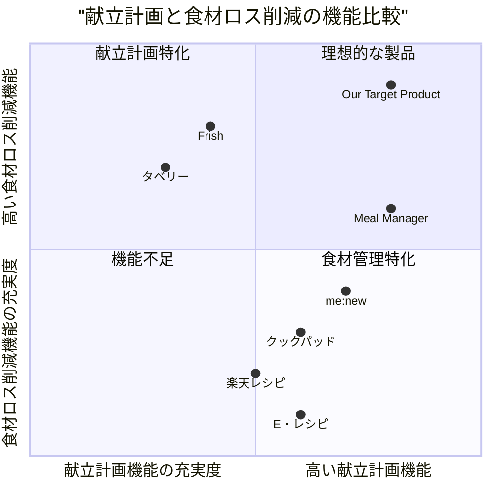

# 食材ロス削減献立アプリ プロダクト要求仕様書 (PRD)

## 概要

本PRDは、1週間分の家庭料理の献立を組み、それに必要な食材の買い物リストを作成するアプリケーションの開発要件をまとめたものです。このアプリは外部APIを活用して献立情報を取得し、食材のロスを最小限に抑えながら効率的な献立計画を提供します。

### プロジェクト情報
- **プロジェクト名**: food_waste_reduction_meal_planner
- **プログラミング言語**: React, JavaScript, Tailwind CSS
- **元の要件**: 1週間分の家庭料理の献立を組み、それに必要な食材の買い物リストを作成するアプリを作成。外部APIを使用して献立を取得し、食材のロスを最小限に抑えるよう献立を組む。

## プロダクト定義

### プロダクトの目標

1. **食材ロスの削減**: ユーザーの冷蔵庫にある食材を最大限に活用し、無駄なく消費できる献立を提案する
2. **効率的な食事計画**: 1週間分の献立を一括で計画し、買い物の頻度を減らして時間と労力を節約する
3. **健康的な食生活の促進**: バランスの取れた栄養価の高い献立を提案し、ユーザーの健康維持をサポートする

### ユーザーストーリー

1. **家庭の主婦として**、買い物に行く前に冷蔵庫にある食材を入力し、それらを使い切る献立を提案してほしい。そうすることで食材を無駄にせず、食費を節約できる。
2. **忙しい会社員として**、週末にまとめて1週間分の献立を計画し、効率よく買い物と下準備ができるようにしたい。そうすることで平日の調理の負担を減らし、時間を節約できる。
3. **一人暮らしの学生として**、少量の食材で複数の料理を作れる献立を知りたい。そうすることで同じ食材を飽きずに消費でき、食費も節約できる。
4. **健康を意識する中年層として**、栄養バランスの取れた献立を自動で提案してほしい。そうすることで健康管理の手間を減らしながら、適切な食生活を維持できる。
5. **調理初心者として**、簡単に作れる料理のレシピを含む献立を提案してほしい。そうすることで無理なく料理スキルを向上させながら、家庭料理を楽しめる。

### 競合分析

1. **me:new（ミーニュー）**
   - 長所: 最長1週間分の献立自動作成、買い物リスト自動生成、栄養価表示、子供向け献立提案
   - 短所: iOSのみ対応、食材ロス削減に特化していない、レシピの多様性に制限あり

2. **クックパッド**
   - 長所: 豊富なレシピ数、ユーザー投稿型で多様なレシピ、検索機能が充実
   - 短所: 献立の自動作成機能が弱い、食材ロス削減の視点が弱い、買い物リスト機能が不十分

3. **Frish**
   - 長所: 冷蔵庫の中身登録、賞味期限管理、期限の近い食材を優先した献立提案
   - 短所: レシピ数が限定的、UIが複雑、1週間分の一括計画機能が弱い

4. **Meal Manager/Meal Planner**
   - 長所: AI食事プランナー、バーコードスキャン機能、パントリー管理
   - 短所: 日本語対応が弱い、日本の食文化に特化していない、高額なサブスクリプション

5. **楽天レシピ**
   - 長所: 豊富なレシピ数、人気ランキング機能、材料から検索可能
   - 短所: 献立の自動作成機能がない、食材の使い回し最適化が弱い、買い物リスト機能が不十分

6. **タベリー**
   - 長所: 食材の管理機能、消費期限アラート、レシピ提案
   - 短所: 献立の一括作成機能が弱い、レシピ数が限定的、ユーザーインターフェースが複雑

7. **E・レシピ**
   - 長所: プロの料理家によるレシピ、季節の特集、栄養価表示
   - 短所: 献立作成の自動化機能がない、食材の最適利用に焦点が当たっていない、買い物リスト機能が限定的

### 競合製品の四象限チャート

## 技術仕様

### 要件分析

本アプリケーションは、ユーザーが効率的に献立を計画し、食材ロスを削減できるよう支援する機能を提供します。外部APIからレシピ情報を取得し、食材の最適利用アルゴリズムを実装することで、無駄のない食材利用を実現します。また、ユーザーの好みや食事制限に基づいたパーソナライズされた献立提案機能も含みます。