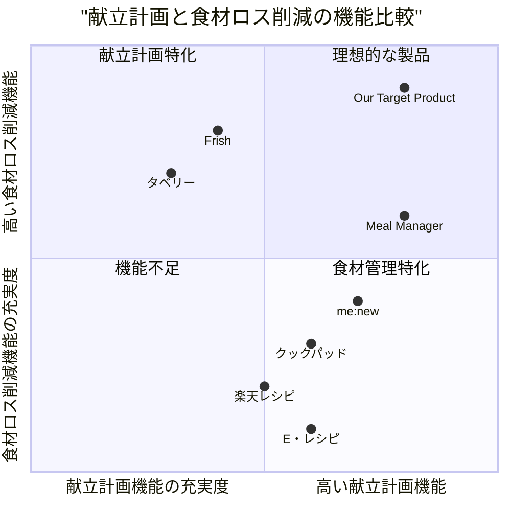

# 食材ロス削減献立アプリ プロダクト要求仕様書 (PRD)

## 概要

本PRDは、1週間分の家庭料理の献立を組み、それに必要な食材の買い物リストを作成するアプリケーションの開発要件をまとめたものです。このアプリは外部APIを活用して献立情報を取得し、食材のロスを最小限に抑えながら効率的な献立計画を提供します。

### プロジェクト情報
- **プロジェクト名**: food_waste_reduction_meal_planner
- **プログラミング言語**: React, JavaScript, Tailwind CSS
- **元の要件**: 1週間分の家庭料理の献立を組み、それに必要な食材の買い物リストを作成するアプリを作成。外部APIを使用して献立を取得し、食材のロスを最小限に抑えるよう献立を組む。

## プロダクト定義

### プロダクトの目標

1. **食材ロスの削減**: ユーザーの冷蔵庫にある食材を最大限に活用し、無駄なく消費できる献立を提案する
2. **効率的な食事計画**: 1週間分の献立を一括で計画し、買い物の頻度を減らして時間と労力を節約する
3. **健康的な食生活の促進**: バランスの取れた栄養価の高い献立を提案し、ユーザーの健康維持をサポートする

### ユーザーストーリー

1. **家庭の主婦として**、買い物に行く前に冷蔵庫にある食材を入力し、それらを使い切る献立を提案してほしい。そうすることで食材を無駄にせず、食費を節約できる。
2. **忙しい会社員として**、週末にまとめて1週間分の献立を計画し、効率よく買い物と下準備ができるようにしたい。そうすることで平日の調理の負担を減らし、時間を節約できる。
3. **一人暮らしの学生として**、少量の食材で複数の料理を作れる献立を知りたい。そうすることで同じ食材を飽きずに消費でき、食費も節約できる。
4. **健康を意識する中年層として**、栄養バランスの取れた献立を自動で提案してほしい。そうすることで健康管理の手間を減らしながら、適切な食生活を維持できる。
5. **調理初心者として**、簡単に作れる料理のレシピを含む献立を提案してほしい。そうすることで無理なく料理スキルを向上させながら、家庭料理を楽しめる。

### 競合分析

1. **me:new（ミーニュー）**
   - 長所: 最長1週間分の献立自動作成、買い物リスト自動生成、栄養価表示、子供向け献立提案
   - 短所: iOSのみ対応、食材ロス削減に特化していない、レシピの多様性に制限あり

2. **クックパッド**
   - 長所: 豊富なレシピ数、ユーザー投稿型で多様なレシピ、検索機能が充実
   - 短所: 献立の自動作成機能が弱い、食材ロス削減の視点が弱い、買い物リスト機能が不十分

3. **Frish**
   - 長所: 冷蔵庫の中身登録、賞味期限管理、期限の近い食材を優先した献立提案
   - 短所: レシピ数が限定的、UIが複雑、1週間分の一括計画機能が弱い

4. **Meal Manager/Meal Planner**
   - 長所: AI食事プランナー、バーコードスキャン機能、パントリー管理
   - 短所: 日本語対応が弱い、日本の食文化に特化していない、高額なサブスクリプション

5. **楽天レシピ**
   - 長所: 豊富なレシピ数、人気ランキング機能、材料から検索可能
   - 短所: 献立の自動作成機能がない、食材の使い回し最適化が弱い、買い物リスト機能が不十分

6. **タベリー**
   - 長所: 食材の管理機能、消費期限アラート、レシピ提案
   - 短所: 献立の一括作成機能が弱い、レシピ数が限定的、ユーザーインターフェースが複雑

7. **E・レシピ**
   - 長所: プロの料理家によるレシピ、季節の特集、栄養価表示
   - 短所: 献立作成の自動化機能がない、食材の最適利用に焦点が当たっていない、買い物リスト機能が限定的

### 競合製品の四象限チャート

## 技術仕様

### 要件分析

本アプリケーションは、ユーザーが効率的に献立を計画し、食材ロスを削減できるよう支援する機能を提供します。外部APIからレシピ情報を取得し、食材の最適利用アルゴリズムを実装することで、無駄のない食材利用を実現します。また、ユーザーの好みや食事制限に基づいたパーソナライズされた献立提案機能も含みます。

### 要件プール

#### P0（必須機能）

1. **献立の自動計画機能**
   - 1週間分（7日）の献立を自動で作成する機能
   - 朝食・昼食・夕食の3食対応
   - 外部APIからのレシピデータ取得・表示

2. **食材の最適活用アルゴリズム**
   - 冷蔵庫の食材を入力できる機能
   - 入力された食材を優先的に使用する献立提案
   - 食材の使い回しを最適化して食材ロスを削減

3. **買い物リスト生成機能**
   - 作成した献立に必要な食材リストの自動生成
   - 冷蔵庫にある食材との照合・差分検出
   - カテゴリ別（野菜、肉、調味料など）の整理表示

4. **基本的なユーザー管理**
   - アカウント作成・ログイン機能
   - 家族構成（人数・年齢層）設定
   - 基本的な好み・苦手食材の設定

#### P1（重要機能）

1. **食材管理機能**
   - 冷蔵庫内の食材管理（追加・削除・更新）
   - 食材の賞味期限・消費期限の管理
   - 食材の残量管理

2. **パーソナライズ機能**
   - ユーザーの食事の好みの学習
   - アレルギー・食事制限への対応
   - 季節や天気に合わせた献立提案

3. **レシピ詳細表示**
   - 料理手順の詳細表示
   - 必要な調理時間・難易度の表示
   - 栄養成分情報の表示

4. **予算管理機能**
   - 週間・月間の食費目標設定
   - 献立の概算コスト計算
   - 食費の節約提案

#### P2（あると良い機能）

1. **ソーシャル機能**
   - 作成した献立の共有機能
   - コミュニティでのレシピ・食材活用アイデア交換
   - SNS連携

2. **高度なカスタマイズ**
   - 調理時間の制約設定
   - 料理のバリエーション設定（和食・洋食・中華など）
   - 特定の食材を使ったレシピ検索

3. **カロリー・栄養管理**
   - 栄養バランスの分析・表示
   - 目標カロリー設定と献立の自動調整
   - 健康目標に合わせた食事提案

4. **スマートデバイス連携**
   - スマート冷蔵庫との連携
   - 音声アシスタント対応
   - バーコードスキャンによる食材登録

### UIデザイン案

#### メイン画面（ホーム）
- 現在の週の献立カレンダー表示（7日分）
- 各日に朝食・昼食・夕食のサムネイル表示
- 今日の献立を大きく表示
- 冷蔵庫ステータス（使うべき食材アラート）
- 買い物リストへのクイックアクセスボタン

#### 献立計画画面
- 週間カレンダービュー
- 料理のドラッグ＆ドロップによる日付・食事の変更機能
- 「献立自動作成」ボタン
- カスタマイズオプション（予算・調理時間・料理ジャンル等）
- 個別料理の差し替え機能

#### 冷蔵庫管理画面
- カテゴリ別の食材リスト
- 食材の追加・編集・削除機能
- 賞味/消費期限に基づく色分け表示
- 残量表示（目盛りバー）
- 「食材スキャン」機能ボタン

#### 買い物リスト画面
- カテゴリ別に整理された必要食材リスト
- 購入済みチェックボックス
- 価格入力オプション
- 手動での項目追加機能
- 「スーパーへマップ表示」ボタン

#### レシピ詳細画面
- 料理写真
- 材料リスト（人数調整機能付き）
- 手順説明（ステップごと）
- 調理時間・難易度・カロリー情報
- 代替材料の提案
- 「献立に追加」ボタン

### 外部API連携

主要な連携APIとして以下を検討します：

1. **楽天レシピAPI**
   - 豊富な日本語レシピデータ
   - カテゴリ検索・ランキング機能の活用
   - 実装の容易さと信頼性の高さ

2. **補助的なAPI**
   - 食材の栄養情報API（オープンフードファクト等）
   - 食材価格情報API（可能であれば）
   - 天気情報API（季節に合わせた献立提案）

### データモデル設計

1. **ユーザーモデル**
   - ユーザーID、名前、メールアドレス、パスワード
   - 家族構成情報（人数、年齢層）
   - 食事の好み設定（好きな料理、苦手な食材、アレルギー）

2. **食材モデル**
   - 食材ID、名前、カテゴリ、単位
   - 保存場所（冷蔵／冷凍／常温）
   - 標準的な保存可能期間

3. **ユーザー食材モデル**
   - ユーザーID、食材ID
   - 購入日、賞味/消費期限
   - 残量、保存場所

4. **レシピモデル**（APIから取得）
   - レシピID、名前、カテゴリ、調理時間、難易度
   - 料理画像URL、出典情報
   - 材料リスト、調理手順
   - 栄養成分情報、カロリー

5. **献立モデル**
   - 献立ID、ユーザーID
   - 日付、食事タイプ（朝食/昼食/夕食）
   - 関連レシピID
   - カスタマイズ情報

6. **買い物リストモデル**
   - リストID、ユーザーID、作成日
   - 食材アイテムリスト（食材ID、必要量、購入状況）
   - 予算情報、メモ

### 食材ロス削減アルゴリズム

このアプリの核となる食材ロス削減アルゴリズムは以下の戦略に基づきます：

1. **期限優先スコアリング**
   - 食材ごとに賞味/消費期限に基づくスコアを計算
   - 期限が近いほど高スコアを付与

2. **使用頻度最適化**
   - 同じ食材を複数の料理で活用するレシピセットを優先
   - 余り食材が最小になるような組み合わせを選択

3. **部分使用最適化**
   - 野菜などの部分使用される食材の効率的な使いきり方法を提案
   - 例：キャベツの残りを別の料理で活用する提案

4. **代替食材提案**
   - レシピの一部食材を冷蔵庫にあるもので代替可能か分析
   - 代替可能な場合は置き換え提案

5. **食材相性マッピング**
   - 相性の良い食材の組み合わせデータベース
   - 残りやすい食材同士の相性の良い組み合わせを優先

### オープンな質問

1. **API選択の最終決定**
   - 楽天レシピAPIの利用上限と安定性の確認が必要
   - バックアップAPIの選定（きょうの料理API等）

2. **食材価格情報の取得方法**
   - 食材の価格情報をどのように取得・更新するか
   - ユーザー入力に依存するか、外部データを活用するか

3. **オフライン機能の範囲**
   - インターネット接続がない状況でどの程度の機能を提供するか
   - オフラインでのデータ同期方法

4. **プライバシー考慮事項**
   - 食材・献立データの扱いに関するプライバシーポリシー
   - データの匿名化と活用の範囲

5. **スケーラビリティ計画**
   - ユーザー数増加に伴うシステム拡張計画
   - 将来的な機能拡張ロードマップ

## プロダクトロードマップ

### フェーズ1（MVP：最小実用製品）
- 基本的な献立自動作成機能
- 食材入力と基本的な最適利用アルゴリズム
- シンプルな買い物リスト生成
- 楽天レシピAPIとの連携

### フェーズ2（コア機能強化）
- 食材管理機能の強化（賞味期限管理等）
- パーソナライズ機能の追加
- レシピ詳細表示の拡充
- UIの改良とユーザーフィードバックの反映

### フェーズ3（拡張機能追加）
- 予算管理機能の実装
- 栄養・カロリー管理機能の追加
- コミュニティ機能の実装
- 外部デバイス・サービスとの連携

## 結論

本PRDで定義したアプリケーションは、日本の家庭における食材ロス削減という社会的課題と、日々の献立作成の負担軽減というユーザーニーズの両方を解決します。楽天レシピAPIを活用し、独自の食材最適利用アルゴリズムを実装することで、競合製品との差別化を図りつつ、ユーザーにとって実用的で価値のあるサービスを提供します。フェーズドアプローチによる開発を進め、継続的なユーザーフィードバックを取り入れながらサービスの改善を行っていきます。
