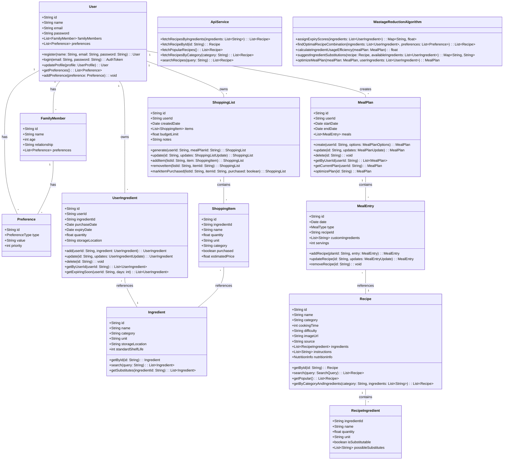
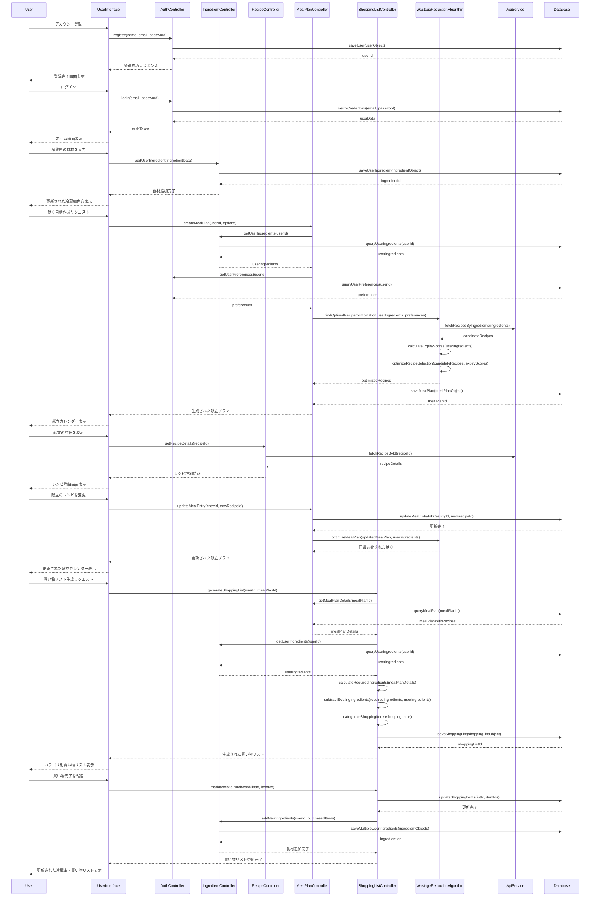

# 食材ロス削減献立アプリ システム設計

## 実装アプローチ

本アプリケーションは、1週間分の献立計画と食材ロス削減を目的としたウェブベースのシステムとして設計します。実装における重要なポイントは以下の通りです。

### 技術スタックの選択

1. **フロントエンド**: React, JavaScript, Tailwind CSS
   - モダンで効率的なUIコンポーネントを構築するためにReactを採用
   - レスポンシブデザインとUIの一貫性を確保するためにTailwind CSSを使用
   - 状態管理にはReduxを採用し、アプリケーション全体のデータフローを管理

2. **バックエンド**: Node.js, Express
   - APIエンドポイントの構築と外部API（楽天レシピAPI）との連携
   - RESTfulなAPIアーキテクチャの採用

3. **データベース**: MongoDB
   - ドキュメント指向のNoSQLデータベースとして採用
   - 食材、レシピ、ユーザー情報などの柔軟なスキーマ管理に適している

4. **外部API**: 楽天レシピAPI
   - 日本語のレシピデータソースとして最適
   - カテゴリ検索や材料検索の機能を活用

### 難易度の高いポイントと解決策

1. **食材ロス削減アルゴリズムの実装**
   - 課題: 食材の最適活用と献立の多様性のバランスを取る必要がある
   - 解決策: スコアリングシステムを実装し、食材の賞味期限、使用頻度、相性を考慮した最適化アルゴリズムを開発

2. **楽天レシピAPIの利用制限への対応**
   - 課題: APIの呼び出し回数制限やレスポンス時間の制約
   - 解決策: レシピデータのキャッシュ戦略と非同期バッチ処理の実装

3. **ユーザー体験の最適化**
   - 課題: 献立計画と食材管理の複雑さをシンプルなUIで提供する
   - 解決策: 段階的な入力フォームと視覚的な献立カレンダーを組み合わせたインターフェース

## データ構造とインターフェース



## プログラム呼び出しフロー



## 不明確な点

1. **楽天レシピAPIの詳細仕様**
   - APIのレート制限やクエリパラメータの詳細情報
   - レスポンス形式とデータの正確性・完全性
   - 特に材料量の表記方法と標準化の必要性を確認する必要があります

2. **食材価格データの取得**
   - 食材価格の取得に関する外部APIの有無
   - ユーザー入力に依存するか、一般的な市場価格のデータベースを構築するか
   - 地域や季節による価格変動の取り扱い方法

3. **アルゴリズムの最適化基準**
   - 食材ロス削減、料理の多様性、栄養バランス等の最適化の優先順位
   - ユーザーの好みと食材ロス削減のバランスをどう取るか
   - 献立の最適化における計算リソースの制約

4. **スケーラビリティの課題**
   - ユーザー数増加に伴うデータベース設計の拡張性
   - APIキャッシュ戦略の詳細設計
   - サーバーサイドの処理負荷分散戦略

## 追加技術詳細

### 楽天レシピAPI統合方法

楽天レシピAPIとの統合は、以下のアプローチで実施します：

1. **APIクライアントの実装**
   - Axiosライブラリを使用したHTTPクライアントの構築
   - APIキー管理と認証プロセスの実装
   - リクエスト制限とエラーハンドリングの実装

2. **データマッピングとトランスフォーメーション**
   - APIレスポンスから内部データモデルへの変換ロジック
   - 材料・分量情報の標準化処理
   - 画像URLの取得と最適化

3. **キャッシュ戦略**
   - Redisを使用した頻繁なクエリ結果のキャッシング
   - カテゴリや人気レシピなど変更頻度の低いデータの定期的な同期
   - キャッシュの有効期限と更新戦略の実装

4. **バックアップメカニズム**
   - APIの障害時やレート制限超過時の代替データソース
   - 最低限のレシピデータベースのローカル保存

### 食材ロス削減アルゴリズムの詳細設計

このアルゴリズムは、以下の要素を組み合わせて食材の最適活用を実現します：

1. **期限優先スコアリング**
   ```pseudocode
   function calculateExpiryScore(ingredient):
       daysUntilExpiry = (ingredient.expiryDate - currentDate).days
       if daysUntilExpiry <= 1:
           return 10.0  // 非常に高い優先度
       else if daysUntilExpiry <= 3:
           return 7.0   // 高い優先度
       else if daysUntilExpiry <= 7:
           return 5.0   // 中程度の優先度
       else:
           return max(1.0, 5.0 - (daysUntilExpiry - 7) * 0.2)  // 徐々に低下する優先度
   ```

2. **相性スコアリング**
   ```pseudocode
   function calculateCompatibilityScore(ingredients):
       totalScore = 0
       for i in range(0, ingredients.length):
           for j in range(i+1, ingredients.length):
               compatibilityFactor = ingredientCompatibilityDatabase.getLookupValue(ingredients[i], ingredients[j])
               totalScore += compatibilityFactor
       return totalScore / max(1, ingredients.length * (ingredients.length - 1) / 2)
   ```

3. **使用効率スコアリング**
   ```pseudocode
   function calculateUsageEfficiencyScore(recipe, availableIngredients):
       usedIngredientCount = 0
       expiringIngredientCount = 0
       
       for ingredient in recipe.ingredients:
           if ingredient exists in availableIngredients:
               usedIngredientCount += 1
               if calculateExpiryScore(ingredient) >= 5.0:
                   expiringIngredientCount += 1
       
       baseEfficiency = usedIngredientCount / recipe.ingredients.length
       expiryBonus = expiringIngredientCount / max(1, availableIngredients.length)
       
       return baseEfficiency * 0.7 + expiryBonus * 0.3
   ```

4. **献立最適化アルゴリズム**
   ```pseudocode
   function optimizeMealPlan(availableIngredients, days, mealsPerDay, userPreferences):
       // 初期化
       mealPlan = initializeEmptyMealPlan(days, mealsPerDay)
       remainingIngredients = copyIngredients(availableIngredients)
       candidateRecipes = fetchCandidateRecipes(availableIngredients)
       
       // 最初に期限が近い食材を使用するレシピを選択
       expiringIngredients = getExpiringIngredients(availableIngredients)
       for ingredient in sortByExpiryScore(expiringIngredients):
           bestRecipes = findRecipesUsingIngredient(ingredient.id, candidateRecipes)
           bestRecipes = sortByUsageEfficiencyScore(bestRecipes, remainingIngredients)
           bestRecipes = filterByUserPreferences(bestRecipes, userPreferences)
           
           if bestRecipes.length > 0:
               selectedRecipe = bestRecipes[0]
               bestSlot = findBestTimeSlotForRecipe(selectedRecipe, mealPlan)
               mealPlan[bestSlot.day][bestSlot.mealType] = selectedRecipe
               updateRemainingIngredients(remainingIngredients, selectedRecipe)
               candidateRecipes.remove(selectedRecipe)
       
       // 残りのスロットを埋める
       for day in range(0, days):
           for mealType in mealTypes:
               if mealPlan[day][mealType] is empty:
                   compatibleRecipes = filterRecipesByCompatibility(candidateRecipes, day, mealType, mealPlan)
                   compatibleRecipes = sortByUsageEfficiencyScore(compatibleRecipes, remainingIngredients)
                   compatibleRecipes = filterByUserPreferences(compatibleRecipes, userPreferences)
                   
                   if compatibleRecipes.length > 0:
                       selectedRecipe = compatibleRecipes[0]
                       mealPlan[day][mealType] = selectedRecipe
                       updateRemainingIngredients(remainingIngredients, selectedRecipe)
                       candidateRecipes.remove(selectedRecipe)
                   else:
                       // バックアップレシピから選択（食材使用効率は低いが好みに合うもの）
                       backupRecipes = fetchBackupRecipes(userPreferences)
                       mealPlan[day][mealType] = selectRandomFromTop(backupRecipes, 5)
       
       return mealPlan
   ```

5. **献立最適化の評価関数**
   ```pseudocode
   function evaluateMealPlan(mealPlan, availableIngredients, userPreferences):
       ingredientUsageScore = calculateIngredientUsage(mealPlan, availableIngredients)
       wasteReductionScore = calculateWasteReduction(mealPlan, availableIngredients)
       varietyScore = calculateVariety(mealPlan)
       preferenceMatchScore = calculatePreferenceMatch(mealPlan, userPreferences)
       nutritionBalanceScore = calculateNutritionBalance(mealPlan)
       
       // 重み付け係数
       w1 = 0.3  // 食材使用効率
       w2 = 0.3  // 廃棄削減
       w3 = 0.15 // 料理バリエーション
       w4 = 0.15 // 好み一致度
       w5 = 0.1  // 栄養バランス
       
       return w1*ingredientUsageScore + w2*wasteReductionScore + w3*varietyScore + w4*preferenceMatchScore + w5*nutritionBalanceScore
   ```

このアルゴリズムの実装では、食材の期限管理、効率的な使い回し、食材の相性、料理の多様性、ユーザーの好みなど、複数の要素をバランスよく考慮しています。また、献立の評価と最適化のためのスコアリングシステムを導入することで、ユーザーにとって実用的かつ食材ロス削減に効果的な献立を生成します。