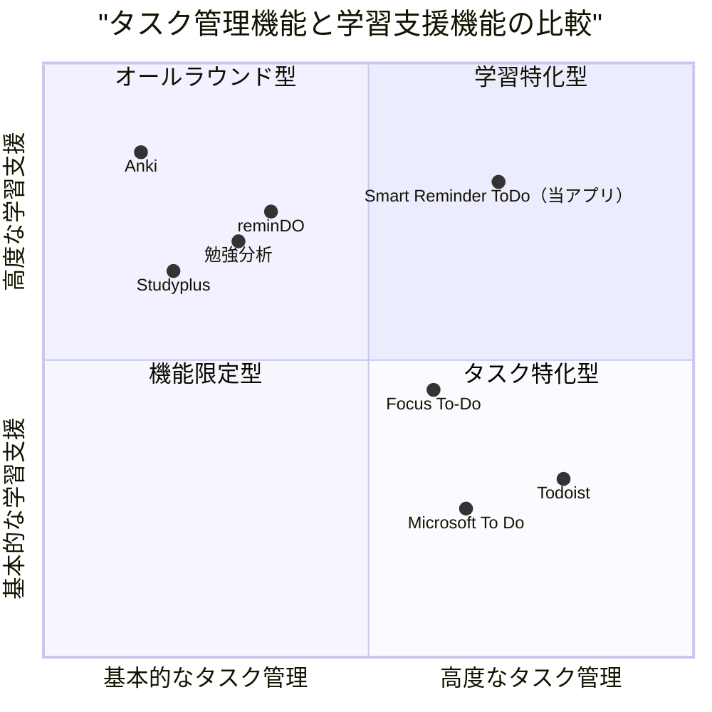

# 学習曲線リマインダー搭載ToDoアプリ製品要件定義書（PRD）

## 1. プロジェクト概要

### 1.1 プロジェクト情報
- **言語**: 日本語
- **プログラミング言語**: React, JavaScript, Tailwind CSS
- **プロジェクト名**: smart_reminder_todo
- **要件**: 学習曲線に沿ったリマインダをしてくれるToDoアプリを作成。そのアプリを使って勉強もできる機能も含める。

### 1.2 プロジェクトの背景と目的
現在、多くのToDoアプリやタスク管理ツールが存在しますが、学習効率を最大化するための忘却曲線に基づいたリマインダー機能と学習サポート機能を統合したアプリはまだ十分に普及していません。本プロジェクトでは、エビングハウスの忘却曲線などの科学的理論に基づいた最適なタイミングでの復習リマインドと、効率的な学習管理を可能にするToDoアプリを開発します。

## 2. 製品定義

### 2.1 製品ゴール
1. **学習効率の最大化**: 忘却曲線に基づいた最適な復習タイミングを自動的に計算し、ユーザーにリマインドすることで、学習効率を最大化する
2. **タスク管理と学習の統合**: 日常のタスク管理と学習管理を一つのアプリで完結させ、シームレスな学習体験を提供する
3. **個別最適化された学習体験**: ユーザーの記憶状態や理解度に応じて、個別に最適化された学習プランとリマインドを提供する

### 2.2 ユーザーストーリー
1. **学生ユースケース**: 「大学生として、試験範囲の内容を効率的に記憶したいので、忘却曲線に基づいたリマインダーで最適なタイミングで復習し、記憶の定着を図りたい」

2. **語学学習者ユースケース**: 「語学学習者として、新しい単語や文法を効果的に覚えたいので、間隔反復学習法に基づいて復習スケジュールを自動的に生成し、継続的な学習をサポートしてほしい」

3. **社会人ユースケース**: 「仕事をしながら資格取得を目指す社会人として、限られた時間で効率的に学習したいので、学習タスクと日常タスクを一括管理し、最適な学習計画を立てやすくしてほしい」

4. **教育者ユースケース**: 「教師として、学生に効果的な学習方法を提案したいので、科学的に実証された学習法に基づいたツールを紹介し、学生の学習効率向上をサポートしたい」

### 2.3 競合分析

| アプリ名 | 長所 | 短所 |
|---------|------|------|
| reminDO | ・忘却曲線に基づいた復習タイミング通知 ・記憶状態に応じた復習スケジュール調整 ・単語帳の共有機能 | ・総合的なタスク管理機能が弱い ・学習コンテンツ作成支援機能が限定的 ・有料機能が多い |
| 勉強分析 | ・忘却曲線の可視化 ・教科書バーコード読取機能 ・使いやすいUI | ・タスク管理との統合がない ・学習分析機能が限られている ・カスタマイズ性が低い |
| Microsoft To Do | ・シンプルな操作性 ・Officeとの連携 ・無料で利用可能 | ・学習管理に特化した機能がない ・忘却曲線に基づいたリマインド機能がない ・学習コンテンツ作成支援がない |
| Todoist | ・多機能なタスク管理 ・他アプリとの連携性が高い ・操作性が良い | ・学習向け機能が不足 ・忘却曲線に基づいた通知機能がない ・有料プランでないと機能制限がある |
| Studyplus | ・学習記録に特化 ・コミュニティ機能 ・参考書登録機能 | ・ToDoリスト機能が弱い ・忘却曲線に基づいた復習管理がない ・総合的なタスク管理ができない |
| Anki | ・強力な間隔反復学習システム ・高いカスタマイズ性 ・多様なコンテンツ対応 | ・UIが直感的でない ・一般的なタスク管理機能がない ・学習以外の用途に使いづらい |
| Focus To-Do | ・ポモドーロテクニック対応 ・タスク管理と集中支援の統合 ・使いやすいインターフェース | ・間隔反復学習機能がない ・記憶定着に特化した機能不足 ・学習分析機能が限られている |

### 2.4 競合分析クアドラントチャート

## 3. 技術仕様

### 3.1 要件分析

Smart Reminder ToDoアプリは、従来のタスク管理機能と科学的な学習理論に基づいた学習支援機能を統合します。主要な要件は以下の通りです：

1. **学習曲線理論の実装**：
   - エビングハウスの忘却曲線に基づくリマインダーシステム
   - SuperMemo SM-2アルゴリズムによる間隔反復学習機能
   - 記憶状態に応じた学習間隔の自動調整

2. **タスク管理機能**：
   - 通常タスクと学習タスクの統合管理
   - カテゴリ分け、優先度設定、締切設定
   - タスク完了状況の視覚的表示

3. **リマインダー機能**：
   - 学習タスク用の忘却曲線ベースのリマインド
   - 通常タスク用のカスタマイズ可能なリマインド
   - 通知方法の選択（プッシュ通知、メール等）

4. **学習支援機能**：
   - 学習内容の理解度評価システム（0-5スケール）
   - 学習コンテンツの作成・編集ツール（問題カード、ノート等）
   - 学習進捗の分析と可視化

5. **データ同期と共有**：
   - マルチデバイス対応（ウェブ、モバイル）
   - 学習コンテンツの共有機能
   - クラウドベースのデータ保存

### 3.2 要件プール

#### P0（必須要件）
1. タスク（ToDo）の作成・編集・削除機能
2. タスクのカテゴリ分け（通常タスクと学習タスク）
3. 学習タスクに対する忘却曲線ベースのリマインダー設定
4. 学習コンテンツ（問題カード等）の作成・編集機能
5. 学習後の理解度評価機能（0-5スケール）
6. 理解度に基づく次回学習タイミングの自動計算
7. プッシュ通知によるリマインド機能
8. ユーザー登録・ログイン機能
9. データのクラウド保存機能

#### P1（重要要件）
1. 学習進捗のグラフ表示
2. 学習履歴の記録と分析
3. タスクの優先度設定
4. 締切日時の設定と通知
5. 繰り返しタスクの設定
6. 学習コンテンツのインポート・エクスポート機能
7. 複数デバイス間でのデータ同期
8. タグ付け機能
9. 検索機能
10. ダークモード対応

#### P2（追加機能）
1. 学習コンテンツの共有機能
2. ソーシャル機能（フレンドの追加、学習状況の共有）
3. 学習グループの作成と管理
4. カスタムテーマの設定
5. オフライン使用モード
6. 音声入力によるタスク作成
7. カレンダービュー表示
8. 画像・音声ファイルの添付機能
9. 学習統計のエクスポート
10. API連携による外部サービスとの統合

### 3.3 UI設計案

#### メイン画面構成
1. **ホーム画面**：
   - 今日のタスク一覧（通常タスクと学習タスクを視覚的に区別）
   - 直近のリマインダー予定
   - クイックアクセスボタン（タスク追加、学習開始など）

2. **タスク管理画面**：
   - タスクのリスト表示
   - フィルタリングオプション（カテゴリ、優先度、締切など）
   - タスクの詳細情報表示

3. **学習画面**：
   - 学習コンテンツの表示
   - 理解度評価インターフェース
   - 学習進捗表示

4. **統計・分析画面**：
   - 学習効率のグラフ
   - 記憶定着率の分析
   - タスク完了率の表示

5. **設定画面**：
   - 通知設定
   - アカウント管理
   - アプリのカスタマイズ

#### ワイヤーフレーム概要

**ホーム画面**：
- 上部：ユーザー名、日付表示、設定アイコン
- 中央上：「今日のタスク」セクション（通常タスクと学習タスクを色分け表示）
- 中央下：「今日の学習リマインダー」セクション
- 下部：タブナビゲーション（ホーム、タスク、学習、統計、設定）

**タスク追加画面**：
- タスクタイプ選択（通常/学習）
- タスク名入力フィールド
- 詳細情報入力エリア
- カテゴリ・タグ設定
- 優先度設定
- 締切設定
- 学習タスクの場合は学習素材追加オプション

**学習画面**：
- 問題カード表示
- 「答えを見る」ボタン
- 理解度評価ボタン（0-5）
- 次の問題へ進むボタン
- 学習セッション進捗バー

### 3.4 技術スタック

**フロントエンド**：
- React.js（Webアプリケーション）
- React Native（モバイルアプリケーション）
- Tailwind CSS（スタイリング）
- Redux（状態管理）

**バックエンド**：
- Node.js
- Express.js
- MongoDB（データベース）
- Firebase（認証、プッシュ通知）

**インフラ**：
- AWS/Google Cloud Platform
- CI/CDパイプライン
- モニタリングツール

### 3.5 セキュリティ要件

1. ユーザー認証の実装（OAuth、JWT等）
2. データの暗号化（保存時および通信時）
3. GDPR、CCPA等のプライバシー規制への準拠
4. 定期的なセキュリティ監査

## 4. オープンクエスチョン

1. **学習曲線のカスタマイズ**：ユーザー個人の記憶特性に応じて、忘却曲線のパラメータをどこまでカスタマイズできるようにするか？

2. **モチベーション維持機能**：長期的な学習継続のためのゲーミフィケーション要素をどのように実装するか？

3. **学習コンテンツの種類**：テキスト以外の学習コンテンツ（画像、音声、動画）をどこまでサポートするか？

4. **収益モデル**：基本無料と有料プランの境界線をどこに引くか？サブスクリプション制か買い切り制か？

5. **アクセシビリティ**：異なる学習スタイルや障害を持つユーザーに対して、どのようなアクセシビリティ機能を提供するか？

## 5. 開発ロードマップ

### フェーズ1: MVP（最小実用製品）開発
- 基本的なタスク管理機能
- シンプルな学習カード作成機能
- エビングハウスの忘却曲線に基づくリマインダー
- プッシュ通知機能
- 基本的なユーザー認証

### フェーズ2: 基本機能強化
- 学習進捗の視覚化
- SM-2アルゴリズムの完全実装
- タグ・カテゴリ管理の強化
- 検索機能の実装
- データ同期機能の実装

### フェーズ3: 高度な機能追加
- 学習コンテンツの共有機能
- 統計分析機能の強化
- ソーシャル機能の追加
- カスタマイズオプションの拡充
- API連携機能の実装

## 6. 成功指標

1. **ユーザー獲得・維持**:
   - 月間アクティブユーザー数
   - ユーザー継続率（1週間、1ヶ月、3ヶ月）

2. **学習効果**:
   - 平均記憶定着率
   - 完了した学習タスクの数
   - 理解度評価の平均スコア

3. **エンゲージメント**:
   - 一日あたりのアプリ使用時間
   - 作成されたタスクの数
   - 実施されたリマインダーのクリック率

4. **技術パフォーマンス**:
   - アプリのクラッシュ率
   - 平均ページ読み込み時間
   - APIレスポンスタイム

## 7. まとめ

本PRDでは、学習曲線に基づいたリマインダー機能を持つToDoアプリ「Smart Reminder ToDo」の要件を定義しました。このアプリは、通常のタスク管理と科学的な学習理論に基づいた学習支援機能を統合することで、ユーザーの学習効率を最大化しながら日常のタスク管理もサポートする画期的なツールとなります。

エビングハウスの忘却曲線やSuperMemo SM-2アルゴリズムなどの科学的理論に基づいたリマインダーシステムにより、ユーザーは最適なタイミングで学習内容を復習することができ、記憶の定着率を大幅に向上させることができます。

開発は段階的に進め、まずは最小実用製品（MVP）を構築し、ユーザーフィードバックを取り入れながら継続的に機能を強化していく計画です。最終的には、タスク管理と学習支援の両面で競合製品を上回る価値を提供し、幅広いユーザーに利用される製品を目指します。